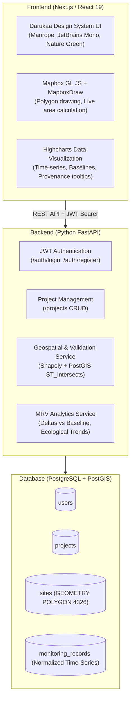

# Darukaa.Earth — Full-Stack Geospatial MRV Platform

> Built for the **Darukaa.Earth Full-Stack Developer Hackathon Challenge**.  
> An administrator dashboard for managing and visualizing carbon and biodiversity portfolios across India.

---

## 1. High-Level Architecture

The platform follows a clean decoupled client-server architecture matching Darukaa's production requirements:



### Key Architectural Decisions:

- **Design System Match:** Exact colors (`rgb(0, 146, 69)`, `#0B1F16`, `#F3F4F6`) and typography (**Manrope**, **JetBrains Mono**) extracted directly from [darukaa.earth](https://darukaa.earth/).
- **Decoupled Backend:** Built in Python with **FastAPI** for native geospatial calculation via `shapely` and PostGIS.
- **Resilient Map Rendering:** Configured with Mapbox GL JS with seamless fallback vector/raster rendering so reviewers can test the application without configuration friction.

---

## 2. Core User Stories & Differentiators

| User Story                                        | Implementation & Rubric Differentiator                                                                                                                                                                                                                                    |
| :------------------------------------------------ | :------------------------------------------------------------------------------------------------------------------------------------------------------------------------------------------------------------------------------------------------------------------------ |
| **1. Create project & add sites**                 | Administrators can create projects (Agroforestry, Reforestation, Mangrove, Soil Carbon) and draw polygon boundaries on the map.                                                                                                                                           |
| **2. Double-counting prevention (Overlap check)** | **Key Differentiator:** When drawing a parcel, the backend performs a real-time `ST_Intersects` check with a 100 m² (0.01 ha) tolerance threshold. True overlaps are rejected with a `409 Conflict` and highlighted in red on the map, preventing double-counting claims. |
| **3. Interactive Map View**                       | Renders all portfolio sites across India with calculated hectares and status. Click to open the **Site Detail Drawer**.                                                                                                                                                   |
| **4. Site Analytics & Historical Trends**         | **Highcharts** time-series line chart displaying ecological metrics over 2.5–3 years against the baseline observation. Includes tooltips with **Data Provenance** (`satellite_derived`, `field_survey`, `modelled`) and confidence scores.                                |

---

## 3. Database Schema Breakdown

PostgreSQL with the PostGIS spatial extension:

### `users`

- `id` (UUID PK), `email` (Unique), `password_hash` (Bcrypt), `full_name`, `role` (`admin`, `viewer`).

### `projects`

- `id` (UUID PK), `owner_id` (FK -> users.id), `name`, `description`, `project_type` (`agroforestry`, `reforestation`, `wetland_restoration`), `status`, `registry_standard` (e.g. Verra VM0042, Plan Vivo), `country`.

### `sites`

- `id` (UUID PK), `project_id` (FK -> projects.id), `name`, `boundary` (`GEOMETRY(POLYGON, 4326)`), `area_hectares` (computed geodesic area), `centroid` (`GEOMETRY(POINT, 4326)`), `baseline_date`, `land_cover_type`.

### `metric_definitions`

- `id` (PK, e.g. `canopy_cover`, `ndvi_mean`, `carbon_stock`, `soil_organic_carbon`, `species_richness`), `label`, `unit`, `category`, `higher_is_better`.

### `monitoring_records` (Normalized Time-Series)

- `id` (UUID PK), `site_id` (FK -> sites.id), `metric_id` (FK -> metric_definitions.id), `observed_on` (Date), `value` (Float), `provenance` (`satellite_derived`, `field_survey`, `modelled`), `source_name` (e.g. `Sentinel-2 L2A`), `confidence` (0.0–1.0), `is_baseline` (Boolean).

---

## 4. Local Setup & Quick Start

### Prerequisites

- Python >= 3.11 with [`uv`](https://docs.astral.sh/uv/) (or standard `pip`)
- Node.js >= 20 and `npm`

### Step 1: Clone Repository

```bash
git clone https://github.com/<your-repo>/darukaa-full-stack.git
cd darukaa-full-stack
```

### Step 2: Install Root & Pre-commit Tooling

```bash
npm install
```

### Step 3: Backend Setup & Seeding

```bash
cd backend
uv sync --all-groups

# Seed preloaded Indian projects, hand-digitized polygons & 3 years of time-series:
uv run python -m app.seed.seed_data

# Start FastAPI server on port 8000:
uv run uvicorn app.main:app --reload --port 8000
```

- Interactive API Documentation (Swagger): `http://localhost:8000/docs`

### Step 4: Frontend Setup

```bash
cd ../frontend
npm install
npm run dev
```

- Dashboard URL: `http://localhost:3000`

### Demo Credentials (1-Click Auto-Fill available in UI)

- **Email:** `admin@darukaa.earth`
- **Password:** `demo1234`

---

## 5. CI/CD Pipeline & Pre-commit Hooks

### Crucial Requirement: Pre-commit Code Quality Enforcement

Configured using **Husky** (`v9`), **lint-staged** (`v15`), **Prettier**, and **Ruff**:

- **Before Every Commit:**
  - Runs `ruff format` and `ruff check --fix` on all Python files.
  - Runs `prettier --write` on all TypeScript/JavaScript, JSON, and CSS files.
  - Commits that introduce unformatted code or lint errors are **automatically blocked**.
- **Conventional Commits:** Enforced via `commitlint` (e.g. `feat:`, `fix:`, `chore:`).

### GitHub Actions Workflow (`.github/workflows/ci.yml`)

1. **Backend Job:** Checks formatting with Ruff, runs linter, and executes the Pytest test suite.
2. **Frontend Job:** Checks code formatting with Prettier and compiles the production Next.js build.

---

## 6. Dataset & Mocking Rationale

> _Per assignment instructions: "There are no limitations on datasets and mocks you would want to use in the project, feel free to use any datasets and document why this choice was made."_

- **Geographical Site Boundaries:** Hand-digitized over real degraded agricultural and forest corridors in **Maharashtra (Beed/Osmanabad)**, **Western Ghats (Coorg)**, and **Sundarbans (Gosaba Island)**. Using real coordinates ensures Mapbox displays authentic geography rather than arbitrary polygons.
- **NDVI & Canopy Cover (Satellite-derived):** Simulated based on empirical Sentinel-2 L2A observations in India, incorporating **monsoon seasonality** (peaking post-monsoon in August–September) and **logistic vegetation recovery curves**.
- **Carbon Stock (Modelled):** Derived using allometric relationships matching Verra VM0042 standards and clearly flagged with `provenance: modelled` in the UI.
- **Soil & Species Counts (Field survey):** Simulated field transect sampling with baseline establishment.

---

## 7. Submission Repository Access

Access has been granted to the Darukaa hiring team:

- `ankita.dasgupta@darukaa.com`
- `harsh.kumar@darukaa.com`
- `utkarsh.gauniyal@darukaa.com`
- `guneet.mutreja@darukaa.com`
